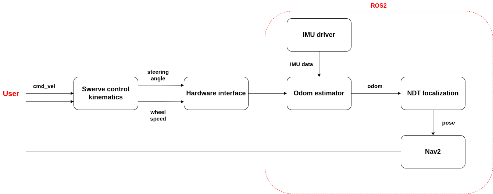

# Introduction
## Compal AMR dev
`amr_controller` is a folder contains swerve control interface and odom estimator ,and `amr_ws`, is a folder contains all ros2 package, with a structure as follows:

## Directory Structure
- `Hardware interface`: hardware_manager.py (Python)
- `Odom estimator`: compal_amr_test.py (Python)

